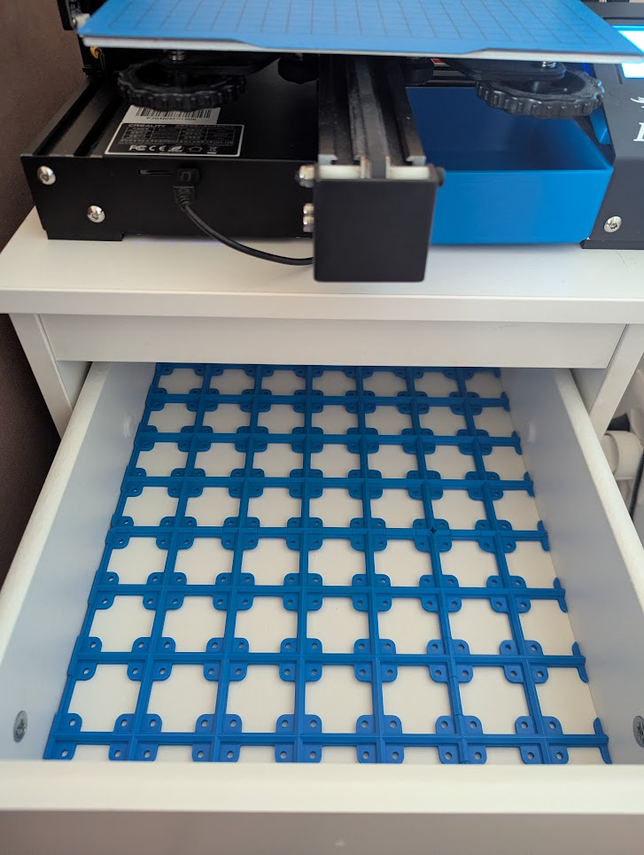

Back in 2022, I won my university’s CTF ([Ulyssis CTF 2022](https://ctf.ulyssis.org/2022/)). My three other team mates and I each won an Ender 3 Pro 3D Printer, kindly sponsored by [DNS Belgium](https://www.dnsbelgium.be). I had always wanted a 3D printer to expirement with, but never could convince myself it was worth the price. So, for me this was the perfect prize! The Ender 3 Pro is fairly hands-on, especially compared to modern 3D printers such as those built by Bambu Labs. I managed to set it up and get it working, but I didn’t really use it for anything besides printing upgrades for the printer itself and some cases for my collection of Raspberry Pis.

Fast-forward to today, and I moved to Geneva for my job at CERN. Moving here was a whole hassle, and so unfortunately the printer didn’t quite make it to the list of things to bring. Of course, you don’t know what you’ve got until it’s gone, and I now came up with a myriad of things I could use the printer for. Luckily for me, my dad came here by car and brought the printer for me. And so, I can finally start finding uses for it!

## Upgrade 1: furniture

By some strange twist of fate, I found an abandoned night stand in the basement of my building that perfectly fit my printer. It was super dirty; but using some “nettoie-tout” and a lot of paper towels, I managed to get it clean. Currently; all my tinkering stuff is stored in a few boxes, and since this little table has two shelves, I figured it was the perfect opportunity to organize everything a bit more. 

After some research, I decided on using the gridfinity system. Gridfinity is a system consisting of a grid with 42 x 42mm cells, upon which you can place, well, basically anything:

I measured the inside of the shelves and found they are about 285 x 338mm. Using [https://gridfinitygenerator.com](https://gridfinitygenerator.com/), I generated a baseplate for the shelve, consisting of four parts (because the print surface of my printer is not large enough), and a bunch of coupling pieces. Unfortunately my printer has some bed adhesion issues, but this I managed to solve by including screw holes. After drawing some containers for the system, the end result looks like this:

## Upgrade 2: Fan upgrade

One of the loudest parts of my printer is a fan on the hot end. I replaced this with a Noctua NF-A4x10 fan, which is much quiter. Since the original fan said 24V, I made the grave mistake of ordering the Noctua fan in the 24V version. Unfortunately, not only people on the internet lie. When I connected the fan, it did not turn. I checked the mainboard to inspect the connection, and then notices that the connector says 12V. Buying the 12V variant fixed the issue for me. This must have been the best upgrade I've ever done though: I keep my printer in my living room, and the difference in noise it makes is astonishing. Definitely worth the hassle!

## Upgrade 3: 3D Touch

One of the things that I find most annoying about the Ender 3 is managing the bed leveling. Basically, the printer bed needs to be completely flat to make your prints come out properly: if the distance between the nozzle and the bed is too small, your layer lines may be too thin or the nozzle might even press into the bed. If the distance is too large, the plastic doesn’t touch the bed and thus doesn’t stick. Levelling the bed on the Ender 3 can be done with 4 screws on the undersize of the printer: tensioning them pulls the bed lower, releasing tension from them lets the bed move a bit up. However, finding the right tension everywhere requires a lot of work, and it is very hard to see when the bed is level.

For this reason, Creality (the company behind the Ender 3) has developed a sensor called the BL-Touch. Because I found the price a bit too high for how much I use the printer, I decided to go with an off-brand version from aliexpress called the 3D Touch. This did require me to print an extra part to mount it.

Installing the sensor is not too hard, but a bit annoying to get the cable to the mainboard. Unfortunately, I have an old model which has version 1.1.4 of the motherboard. To use the 3D Touch sensor, I need to flash a different firmware on the board. Newer versions of the motherboard have made this easier, but I’ll have to use an Arduino to flash the firmware. Since I already had so much trouble with the fan, I decided to wait a bit before flashing my printer's firmware. The results of this will be for another blogpost! 