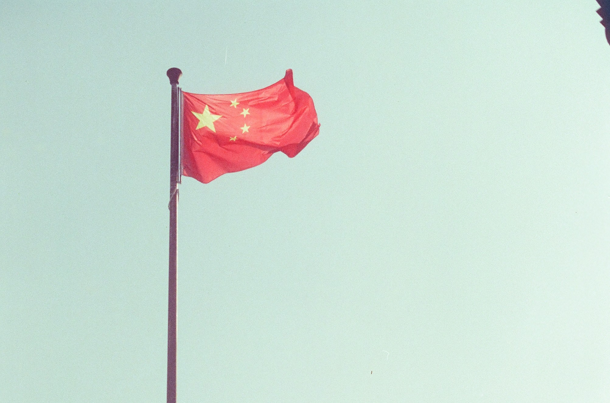
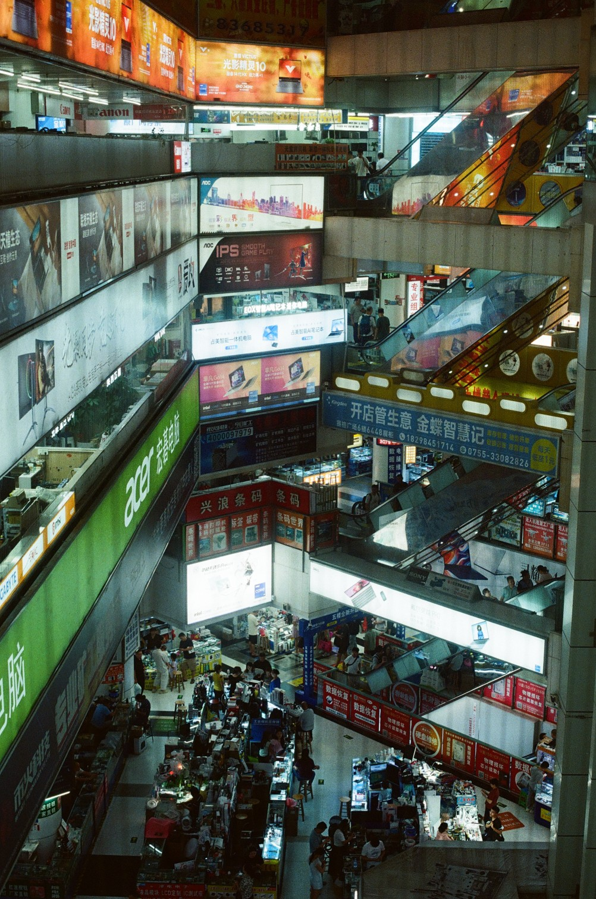

# Travel notes on China

In the summer of 2024, I traveled to China with six of my friends. We spent three weeks in the country, visiting many places. I was lucky to have my friend Junan accompany me, as he speaks Chinese. This is the first lesson I learned in China: it is *incredibly* hard to get around without speaking Chinese. In this post, I will highlight all the things that amazed me and surprised me while traveling, and I will do this by going over all the different places we visited. China is an enormous country, so just like in the EU or US, there are very large regional differences. Before we get there, I would like to go over the recent history of China a bit, as this gives some very useful background information. At the end of this post, I will also post some concrete tips should you be willing to trail in my footsteps.

## Recent history of China
China has had a very tumultuous history over the past two centuries. 

## Itinerary
Our journey started in Beijing, going over Xi'an, Zhangjiajie, Shanghai, Qingtian, Wenzhou and Hong Kong; with a departing flight from Shenzhen

### Beijing
Beijing (北京, Peking), literally "Northern Capital", is a city in the North of China, relatively close to China's borders with Mongolia and Korea. It first served as a capital city in 1261 and was named Beijing in 1403 to distinguis the city from Nanjing ("Southern Capital"). With over 22 million residents, Beijing is China's second most populous city. Having been the capital of China for a very long time, Beijing has many interesting and historic sites to offer. Since we only had a few days here, we unfortunately had to make a selection of places to visit. 

#### Temple of Heaven 

### Xi'an

### Zhiangjiajie
Zhiangjiajie ...

and we liked it

### Shanghai

### Hong Kong

Hong Kong is one of the southern most cities of China. It is a very strange place: Hong Kong only became a part of China in 1997, after the British decided to hand over Hong Kong to China in 1984. 

### Shenzhen
Shenzhen is a very unique city; it was created in 1980 as the first of China's "Special Economic Zones". In the time that has passed since then, Shenzhen has gone from a fisherman's village with a few thousand inhabitants to a metropolis with over 10 million inhabitants. Shenzhen is located centrally in China's Southern Bay Area, only 30 minutes North of Hong Kong and ... minutes east of Guangzhou (or Canton). 

Since its inception, Shenzhen has gone on to become China's tech capital. The headquarters of numerous large Chinese tech companies are located here, such as Huawei, Xiaomi, DJI and Tencent. Many semiconductor and electronics production facilities are also located here. Because of this, Shenzhen features many large electronics markets, with dozens of floors in dozens of buildings full of market stalls that try to sell you every possible piece of electronics. We visited one of the most popular of these: SEG Plaza, located in the Huaqiangbei area of Shenzhen.

